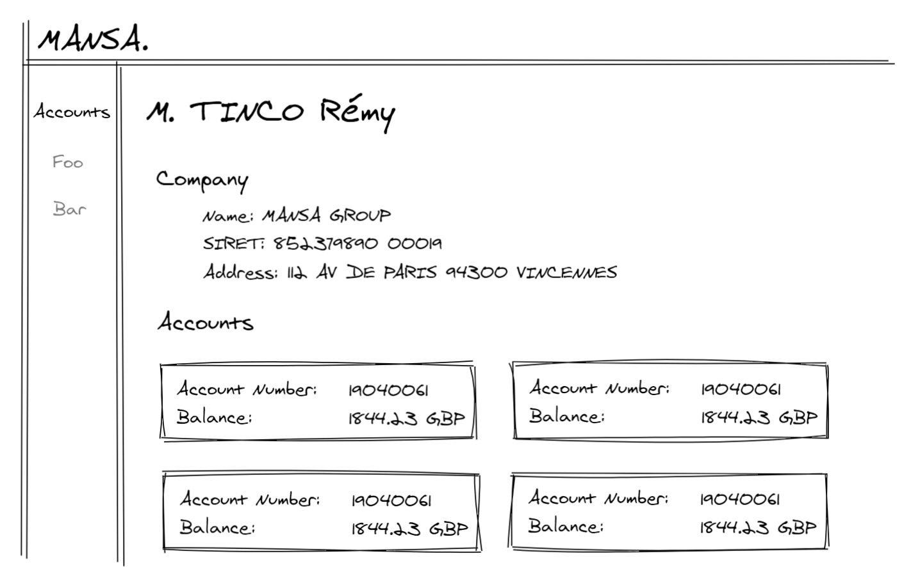
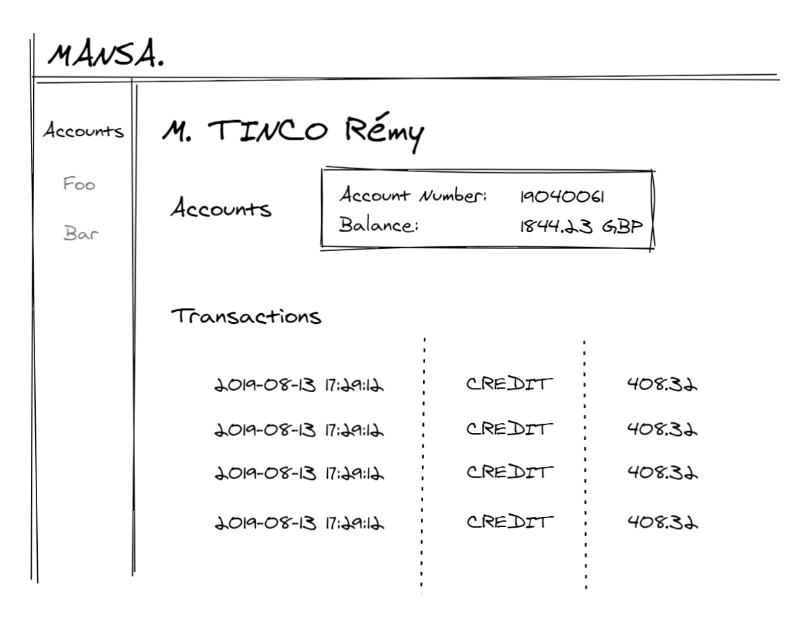

# :crystal_ball: Mansa Front-end Developer Coding Test

Be sure to read **all** of this document carefully, and follow the guidelines within.

## Context

We need you to create a business user interface where you can see :

- Personal user information
  - First & Last name
- Business user
  - SIRET
  - Starting date
  - Address (Ex: 10 Rue Gabriel Peri 92120 Montrouge)
- Financial information
  - Account type {TRANSACTION / SAVINGS}
  - Current balance

We will not provide you a wireframe to follow or a screenshot of our current dashboard.
The view is on one, only one, user.

You will need to leverage an open API for business data to fill in the details and functionality as described below. You are only required to complete desktop views, unless otherwise instructed.

## Requirements

### Tech stack

At Mansa, we're big fans of React. Our stack consists of React (with hooks), TypeScript, XState, RxJS, Ramda, CSS in JS with Emotion. We are using Jest for unit tests. We encourage you to solve the task in this stack, if you're comfortable with it. Solutions using React are mandatory. create-react-app is a standard option to create a new React project and you are free to use it if you choose to.

You're also free to use a component library to get you started and any other package that you find required.

Static type checking is a great way to introduce additional level of safety into your code and we welcome solutions written in TypeScript, but javascript is good too.

Despite the above stack, we accept answers using different choices of libraries as long as you keep React.js.
The use of component libraries, like Material UI, might make this easier for you and is encouraged. Feel free to use a js chart library if you want too.

We like to write clean code using proper programming patterns and JavaScript / Typescript best practices and expect you to strive to do the same.

We expect you to provide tests alongside your code. The minimum requirement is that the code will be unit tested. End to end tests are a big plus. From our experience Cypress.js works very well for React application testing, but you're free to pick your favourite.

Remarks:

- Use es6 or later, do not use es5.
- Do **not** use jquery.
- Use vanilla css or sass / scss (compile to css via webpack loader).

### SIREN Api

For business information, we'll use the SIREN public API.
You can find the documentation about it here <https://entreprise.data.gouv.fr/api_doc_sirene>

We'll use the `unites_legales` object.

The URL is : `https://entreprise.data.gouv.fr/api/sirene/v3/unites_legales/${SIREN}`

For example : <https://entreprise.data.gouv.fr/api/sirene/v3/unites_legales/833079619>

You can choose any Siren you want for your test.

### Mansa API

For financial information, you'll use our custom API :

| Endpoint                                                            | Data                                                                                                                                                                                                                                                                                | Method |
| ------------------------------------------------------------------- | ----------------------------------------------------------------------------------------------------------------------------------------------------------------------------------------------------------------------------------------------------------------------------------- | ------ |
| /accounts                                                           | Fetch all bank accounts from a _test user_.                                                                                                                                                                                                                                         | [GET]  |
| /accounts/:account*id/transactions?from=\_start_date*&to=_end_date_ | Fetch the specified _account_id_ transactions from the _start_date_ to the _end_date_. Date are ISO 8601 UTC, so for example `2018-08-13T03:24:00` It can't return more than **365 days** of transactions. If there are no date specified, the oldest transaction will be returned. | [GET]  |

Root endpoint is : <https://kata.getmansa.com/>

You can see our backend readme test if you want more information about this endpoint.

### :confetti_ball: Bonus

- Also create responsive mobile version
- Write clear **documentation** on how the app was designed and how to run the code.
- Provide proper e/e tests.
- Typescript
- Provide components in [Storybook](https://storybook.js.org) with tests.
- Beautiful charts
- Write concise and clear commit messages.
- Provide an online demo of the application.
- Include subtle animations to focus attention
- Complete user information (Profil picture, phone number, etc ...) with another API like [randomuser](https://randomuser.me)
- Describe optimization opportunities when you conclude

### Design

At first I was very relunctant to write this section because I want to give you some freedom on how design this test. But since there is so much people asking me for insight I provide you some draft of design you can do.
Feel free to make something different and/or improve it !

## What We Care About

Use any libraries that you would normally use if this were a real production App. Please note: we're interested in your code & the way you solve the problem, not how well you can use a particular library or feature.

_We're interested in your method and how you approach the problem just as much as we're interested in the end result._

Here's what you should strive for:

- Good use of current HTML, CSS, and JavaScript / Typescript & performance best practices.
- Solid testing approach.
- A consistent architecture, focused on the simplicity of the project (** keep it simple! **)
- Keep one CSS methodologies like BEM, SMACSS, OOCSS, ITCSS or Atomic CSS.
- Extensible code.

## :gift: The Deliverable

- A bundled/archived repository showing your commit history or a link to an accessible private repository with your work in (Github can host personal private repositories for free). Git example for sending us a standalone bundle:

        git bundle create <yourname>.bundle --all

- A README.md file explaining the decisions you've made solving this task including technology and library choices.
- Any instructions required to run your solution and tests in a unix environment.

## :godmode: About Mansa

At Mansa, we are on a mission to make freelancers workers spend less time on bureaucracies and more time using their money consciously, giving them access to loans with lower interest rates and longer term. To achieve this, we are developing a platform that involves the entire product chain and we aim to become leaders in credit services in Europe.

To face this challenge, we need people who believe in the impact of our business on one country's economy. More than that, we want to work with people who are not content with the obvious, who participate, without being afraid of making mistakes and learning, and who inspire others, with ideas to simplify people's routine.

Good luck! :boom:

## Q&A

> Where should I send back the result when I'm done?

Fork this repo and send us a pull request when you think you are done. There is no deadline for this task unless otherwise noted to you directly.
You can also directly send me your bundle at remy.tinco'@'getmansa'.com

> There's something on the task I don't understand

If you have a doubt and can't reach us to clarify it, make the assumption that feels more natural, document it and move on. We will evaluate based on that assumption.

For example, if you don't know which attribute you should list on the homepage choose some attributes and move on.

> Can I have some extra time to add more features ?

Adding extra features is great and we will look at them as well. But the best thing you can do if you have extra time is to complete as much as you can the features that are requested already. For example, try adding tests or more documentation, we will value that more than having a user management module.

> What if I have a question?

Just create a new issue in this repo and we will respond and get back to you quickly. You can also send me an email remy.tinco'@'getmansa'.com
Asking questions is good. We will not penalize you for asking questions.
